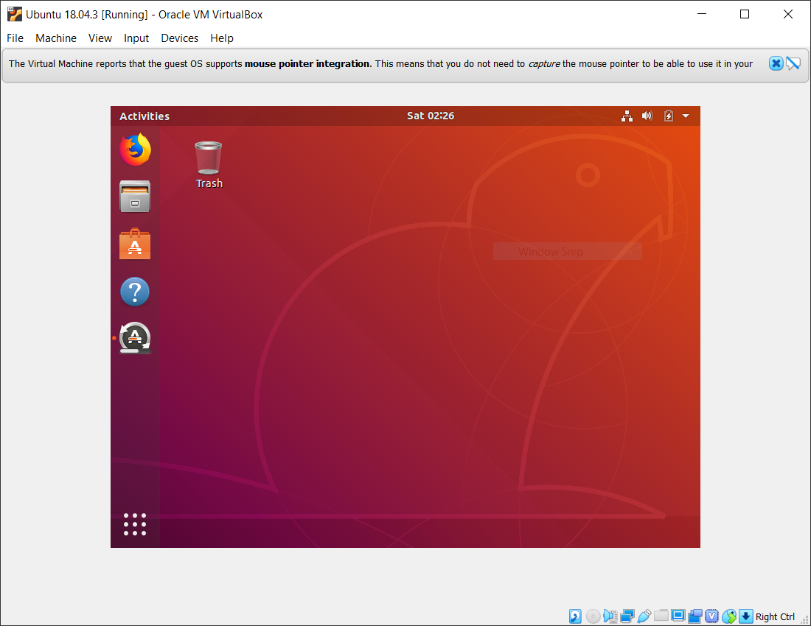
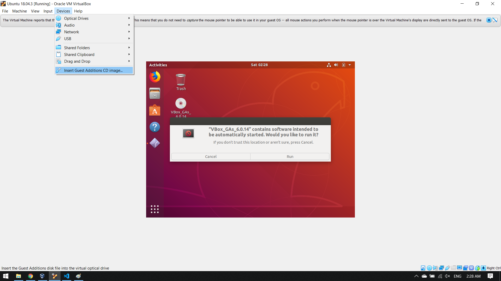
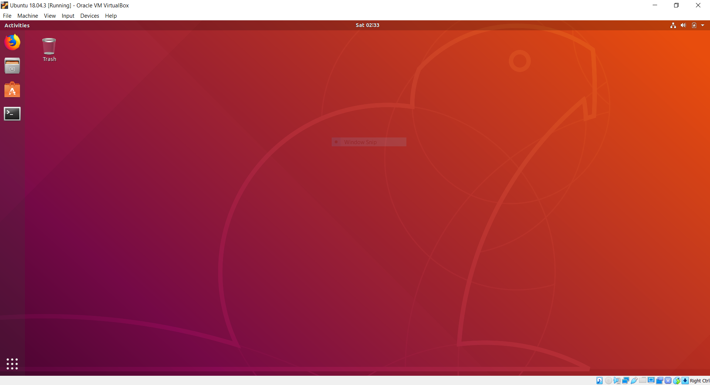
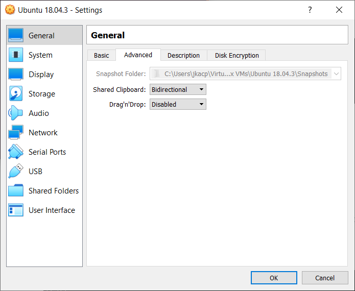
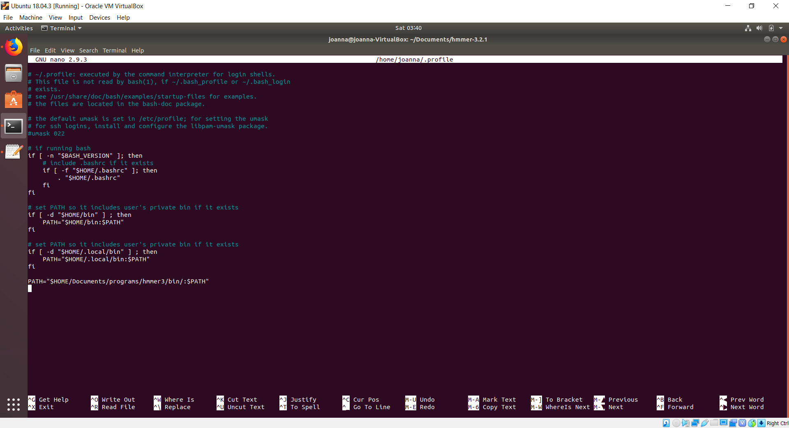

- [hmmer3 - new machine setup](#hmmer3---new-machine-setup)
  - [install virtualbox](#install-virtualbox)
  - [download ubuntu image](#download-ubuntu-image)
  - [create a virtual machine](#create-a-virtual-machine)
  - [install prerequisites](#install-prerequisites)
    - [build-essential](#build-essential)
  - [install hmmer3](#install-hmmer3)


# hmmer3 - new machine setup

This document covers new machine setup using:

* :file_folder: windows as the host operating system
* :computer: virtualbox
* :penguin: ubuntu 18.04.3 (LTS)

The intention is not to provide a comprehensive, step-by-step tutorial, but instead to create a list of steps to follow when setting up a new machine for hmmer3.

## install virtualbox

Download virtualbox from [here](https://download.virtualbox.org/virtualbox/6.0.14/VirtualBox-6.0.14-133895-Win.exe) and install it.

## download ubuntu image

You can find Ubuntu 18.04.3 LTS ISO [here](https://ubuntu.com/download/desktop/thank-you?country=IE&version=18.04.3&architecture=amd64).

## create a virtual machine

Create a new virtual machine, install Ubuntu from the downloaded ISO. After the OS is installed, it will start updating itself and will look something like this:



Install quest additions for optimal virtual machine performance:



Once installed, the VM resolution should be adjusted to the resolution of the virtualbox window and you should notice an improvement in the overall virtual machine performance.



An important thing to do is to enable clipboard sharing between the host machine and the virtual machine so that you can copy & paste data between the two. Clipboard sharing is disabled by default. Change the `Shared Clipboard` value to `Bidirectional`:



## install prerequisites

Execute the following commands in terminal:

### build-essential

```bash
sudo apt-get install build-essential
```

## install hmmer3

At the time of writing this, the current version of hmmer3 is 3.2.1. You can get it from here: http://eddylab.org/software/hmmer/hmmer-3.2.1.tar.gz. The assumption is that you download this file to your `Downloads folder`.

We will set up a hmmer3 folder in your `Documents`. Follow the commands below to copy, uncompress and ultimately delete the downloaded file from your `Documents` and from `Downloads`:

```bash
joanna@joanna-VirtualBox:~$ cd ~/Documents/
joanna@joanna-VirtualBox:~/Documents$ ls
joanna@joanna-VirtualBox:~/Documents$ cp ~/Downloads/hmmer.tar.gz .
joanna@joanna-VirtualBox:~/Documents$ ls
hmmer.tar.gz
joanna@joanna-VirtualBox:~/Documents$ tar xvzf hmmer.tar.gz 
...
# list of uncompressed files shown here...
...
joanna@joanna-VirtualBox:~/Documents$ ls
hmmer-3.2.1  hmmer.tar.gz
joanna@joanna-VirtualBox:~/Documents$ rm hmmer.tar.gz 
joanna@joanna-VirtualBox:~/Documents$ ls
hmmer-3.2.1
joanna@joanna-VirtualBox:~/Documents$ rm ~/Downloads/hmmer.tar.gz
joanna@joanna-VirtualBox:~/Documents$ cd hmmer-3.2.1/
```

Now that we are in the hmmer3 catalog, we can build and install it using the following commands (you can find more detailed instructions and references in  `README.md`):

```bash
joanna@joanna-VirtualBox:~/Documents/hmmer-3.2.1$ ./configure --prefix ~/Documents/programs/hmmer3
joanna@joanna-VirtualBox:~/Documents/hmmer-3.2.1$ make
joanna@joanna-VirtualBox:~/Documents/hmmer-3.2.1$ make check
joanna@joanna-VirtualBox:~/Documents/hmmer-3.2.1$ make install
```

Hmmer3 will be installed in your `Documents`, in a catalog `programs/hmmer3`:

```bash
joanna@joanna-VirtualBox:~/Documents/hmmer-3.2.1$ ls ~/Documents/programs/hmmer3/
bin  share
```

Now that hmmer3 is installed, we will need to tell Ubuntu where to find it so that we can execute it from any catalog when using terminal. To do that, open the `~/.profile` file using a text editor of your choice (I am using `nano`):

```bash
joanna@joanna-VirtualBox:~/Documents/hmmer-3.2.1$ nano ~/.profile
```

And add the following line at the end of the file:

```bash
PATH="$HOME/Documents/programs/hmmer3/bin/:$PATH"
```

Your `~/.profile` file should look like this:



Make Ubuntu interpret this file now (it gets interpreted every time you restart your machine, but let's not waste time for it now):

```bash
joanna@joanna-VirtualBox:~/Documents/hmmer-3.2.1$ env | grep PATH
WINDOWPATH=1
PATH=/usr/local/sbin:/usr/local/bin:/usr/sbin:/usr/bin:/sbin:/bin:/usr/games:/usr/local/games:/snap/bin
joanna@joanna-VirtualBox:~/Documents/hmmer-3.2.1$ source ~/.profile 
joanna@joanna-VirtualBox:~/Documents/hmmer-3.2.1$ env | grep PATH
WINDOWPATH=1
PATH=/home/joanna/Documents/programs/hmmer3/bin/:/usr/local/sbin:/usr/local/bin:/usr/sbin:/usr/bin:/sbin:/bin:/usr/games:/usr/local/games:/snap/bin
```

`$PATH` is your environment variable that tells Ubuntu where to look for programs. First command above displays its current value, then the second command makes Ubuntu read and interpret your `~/.profile` instructions and finally, the third command displays the new value of `$PATH` and you can see that it is updated with the location of hmmer3 executables. Now you can execute hmmer3 programs from whichever catalog you are in while using terminal. Example:

```bash
joanna@joanna-VirtualBox:~/Documents/hmmer-3.2.1$ cd ~
joanna@joanna-VirtualBox:~$ hmmscan
Incorrect number of command line arguments.
Usage: hmmscan [-options] <hmmdb> <seqfile>

where most common options are:
  -h : show brief help on version and usage

To see more help on available options, do hmmscan -h
```

This will make using hmmer3 programs much easier in the future.